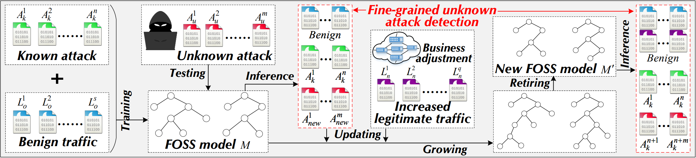

### FOSS: Towards Fine-Grained Unknown Class Detection against the Open-Set Attack Spectrum with Variable Legitimate Traffic



## Introduction

FOSS is the anomaly-based network intrusion detection system which aims to achieve: (i) fine-grained unknown attack detection and (ii) ever-changing legitimate traffic adaptation. The architecture of FOSS mainly includes model construction, outlier detection & classification, and model update. This anonymous repository displays the corresponding source code for model implementation. 

## Requirements

```bash
pip install scipy
pip install numpy
pip install pandas
pip install tqdm
pip install pyecharts
pip install joblib
pip install pickle
pip install sklearn
```

## Feature Extraction

The feature extraction program is stored in ./overview/feature.py. 
Please configure the data input path that includes PCAP traffic split by 5-tuple. 
```bash
python feature.py
```

## Model 

The main function is stored in ./model/main_process.py.
```bash
python main_process.py
```

## Evaluation

The folder ./evaluation/monte_carlo/ shows the feature selection based on the weighted entropy in the Monte Carlo method. 

The feature perception evaluation results for 8 types of attacks from IDS are shown in ./evaluation/feature_perception/. 	


### References
- [Kitsune: An Ensemble of Autoencoders for Online Network Intrusion Detection](https://arxiv.org/abs/1802.09089), Yisroel Mirsky, Tomer Doitshman, Yuval Elovici, and Asaf Shabtai - NDSS 2018
- [Realtime Robust Malicious Traffic Detection via Frequency Domain Analysis](https://dl.acm.org/doi/10.1145/3460120.3484585), Chuanpu Fu, Qi Li, Meng Shen, and Ke Xu - CCS 2021
- [FARE: A Flow Sequence Network For Encrypted Traffic Classification](https://www.ndss-symposium.org/ndss-paper/fare-enabling-fine-grained-attack-categorization-under-low-quality-labeled-data/), Junjie Liang, Wenbo Guo, Tongbo Luo, Vasant G. Honavar, Gang Wang, and Xinyu Xing - NDSS 2021
- [Random Partitioning Forest for Point-Wise and Collective Anomaly Detection - Application to Network Intrusion Detection](https://ieeexplore.ieee.org/document/9319404), 	Pierre-Francois Marteau - TIFS 2021
- [Classification Under Streaming Emerging New Classes: A Solution Using Completely-Random Trees](https://ieeexplore.ieee.org/document/7893709), Xin Mu, Kai Ming Ting, and Zhi-Hua Zhou - TKDE 2017
- [Conditional Variational Auto-Encoder and Extreme Value Theory Aided Two-Stage Learning Approach for Intelligent Fine-Grained Known/Unknown Intrusion Detection](https://ieeexplore.ieee.org/document/9439944), 	Jian Yang, Xiang Chen, Shuangwu Chen, Xiaofeng Jiang, and Xiaobin Tan - TIFS 2021
